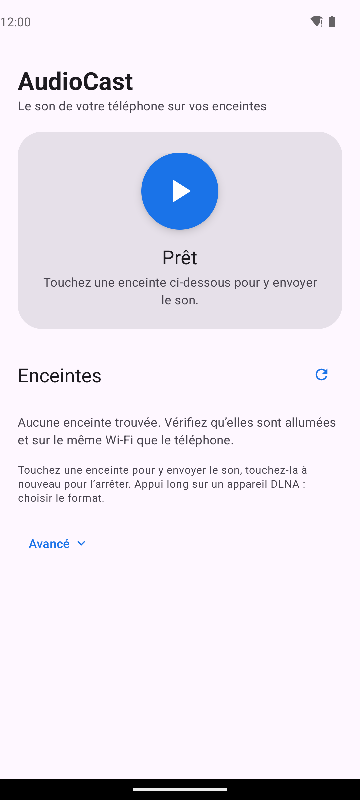
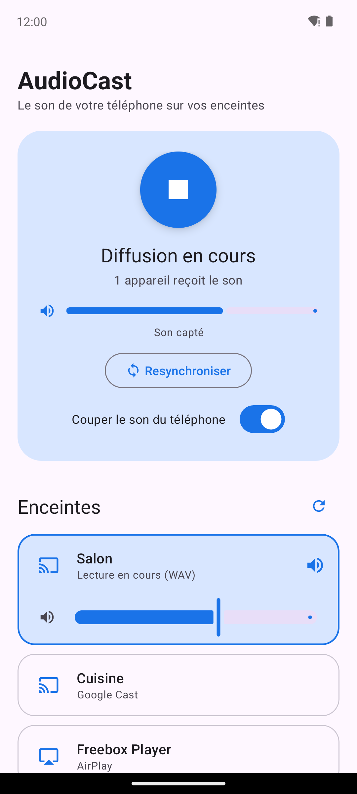
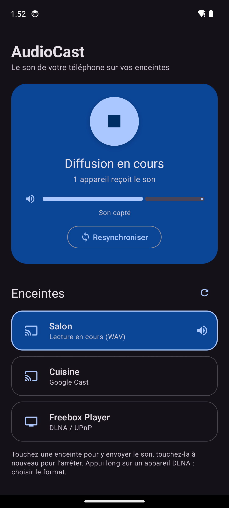

# AudioCast

Application Android qui diffuse **le son de votre téléphone** (musique, podcasts, jeux, vidéos…) vers :

- **les enceintes Google / Chromecast en Wi-Fi** : Nest Audio, Nest Mini, Chromecast Audio, téléviseurs avec Chromecast, groupes d'enceintes Google Home ;
- **les récepteurs AirPlay en Wi-Fi** (AirMedia chez Free) : Freebox Player, Apple TV, enceintes compatibles ;
- **les lecteurs DLNA/UPnP en Wi-Fi** : Sonos, Freebox Player, TV connectées, amplis et enceintes réseau (Denon/HEOS, Yamaha MusicCast, Bose…) ;
- **n'importe quel autre lecteur du réseau** (VLC, Kodi, navigateur web d'un PC ou d'une TV…) grâce à une adresse de flux HTTP.

## Fonctionnement

```
 Applis du téléphone ──► Capture audio Android 10+ ──► Encodage AAC ──► Serveur HTTP local (port 8765)
 (Spotify, YouTube…)     (AudioPlaybackCapture)        (MediaCodec)          │
                                                                              ├──► Enceinte Google Cast (Wi-Fi)
                                                                              ├──► Lecteur DLNA/UPnP (Wi-Fi)
 Capture PCM 44,1 kHz ─────────────────────► ALAC + RTP (RAOP) ─────────────────► Récepteur AirPlay (Wi-Fi)
                                                                              └──► VLC / navigateur / Kodi…
```

1. `AudioCaptureService` capture le son joué par les autres applications via l'API
   `AudioPlaybackCaptureConfiguration` (autorisation de « capture d'écran » demandée au démarrage).
2. `AacEncoder` encode le son en AAC-LC 48 kHz stéréo 192 kb/s (trames ADTS).
3. `StreamServer` diffuse le flux sur `http://<ip-du-téléphone>:8765/stream.aac` (AAC),
   `/stream.wav` (PCM/WAV) et `/stream.l16` (LPCM, format obligatoire de la norme DLNA).
4. `MainActivity` envoie cette adresse à l'enceinte choisie :
   - Google Cast : SDK Google Cast, récepteur multimédia par défaut (sans inscription à la console Cast) ;
   - DLNA/UPnP (`Dlna.kt`) : découverte SSDP des `MediaRenderer`, puis commandes SOAP
     `SetAVTransportURI` + `Play`, puis vérification (`GetTransportInfo` + connexion au flux).
     Les formats annoncés par l'appareil (`GetProtocolInfo`) sont essayés en premier.

### AirPlay (`AirPlay.kt`, `Raop.kt`)

Découverte mDNS (`_raop._tcp`) avec le NsdManager d'Android, puis protocole AirPlay 1 (RAOP) :
négociation RTSP (`ANNOUNCE`/`SETUP`/`RECORD`), son en ALAC non compressé dans des paquets RTP UDP
(352 échantillons), chiffrement AES si le récepteur l'exige, synchronisation et horloge NTP sur les
ports de contrôle et de timing, renvoi des paquets perdus. Latence d'environ 2 s.

## Utilisation

| Accueil | Diffusion en cours | Thème sombre |
|---|---|---|
|  |  |  |

1. Téléphone et enceintes sur le **même réseau Wi-Fi**.
2. Ouvrez AudioCast : les enceintes Google Cast et DLNA apparaissent dans une seule liste
   (bouton ⟳ pour relancer la recherche).
3. Touchez une enceinte : la capture démarre, acceptez la demande d'Android puis lancez votre musique.
   Touchez à nouveau l'enceinte pour l'arrêter ; le gros bouton arrête tout.
4. Appui long sur un appareil DLNA pour choisir soi-même le format.
5. Section **Avancé** : adresse du flux pour VLC / navigateur, et journal de diagnostic.

Pour une enceinte Bluetooth, il suffit de l'appairer dans les réglages Android : le téléphone y envoie
le son directement, sans passer par AudioCast.

## Limites à connaître

- **Android 10 minimum** (API de capture audio).
- Les applications peuvent **interdire la capture** de leur son (Netflix, certaines applis protégées, applis
  très anciennes). Dans ce cas l'enceinte reste silencieuse pour ces applis.
- Le Wi-Fi ajoute **quelques secondes de latence** (mise en mémoire tampon par l'enceinte) :
  parfait pour la musique, pas adapté à la vidéo avec synchronisation labiale.
- Le téléphone continue de jouer le son localement : baissez son volume ou utilisez un casque.
  Sur certains appareils, couper complètement le volume média coupe aussi la capture.
- DLNA : chaque fabricant interprète la norme à sa façon. L'application essaie automatiquement
  plusieurs formats (LPCM/L16, WAV, AAC) jusqu'à ce que le lecteur lise vraiment le flux ; un appui
  long sur un appareil permet d'imposer un format. Le **journal** en bas de l'écran montre ce que
  chaque appareil demande au téléphone. Le PCM (L16/WAV) consomme environ 1,5 Mb/s sur le Wi-Fi.
- Décalage : Google Cast garde quelques secondes en mémoire tampon. Le bouton **Resynchroniser**
  relance la lecture pour repartir du direct, et le téléphone ne garde jamais plus de ~2 s
  d'avance pour une enceinte en retard.

## Télécharger l'APK

**Dernière version :** https://github.com/Yggdrasil82/Application-de-cast/releases/latest
(fichier `AudioCast-<version>.apk`, par exemple `AudioCast-1.0.7.apk`)

Chaque push compile l'APK avec GitHub Actions et le publie dans une
[Release](https://github.com/Yggdrasil82/Application-de-cast/releases). Les versions successives
sont signées avec la même clé (`app/debug.keystore`, clé de développement) : une nouvelle version
s'installe par-dessus l'ancienne.

## Compilation

En local, avec Android Studio ou le SDK Android installé :

```bash
./gradlew assembleDebug
# APK : app/build/outputs/apk/debug/app-debug.apk
```

## Pistes d'amélioration

- Réglage de la qualité (débit) et de la latence.
- Envoi simultané vers plusieurs enceintes Cast individuelles (les groupes Google Home le permettent déjà).
